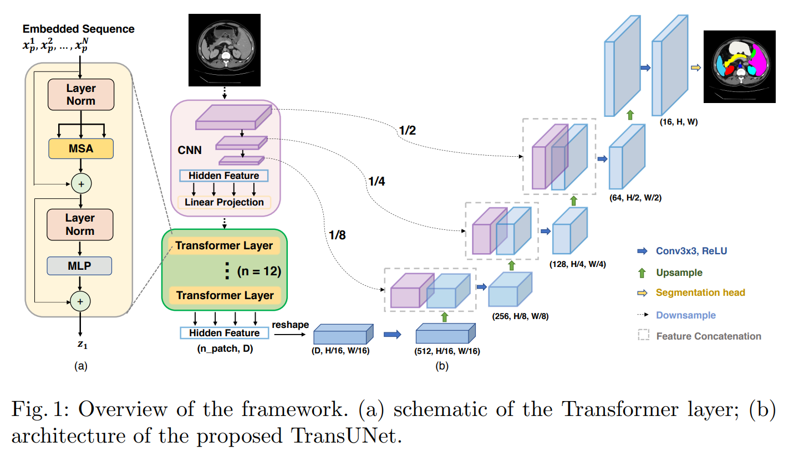
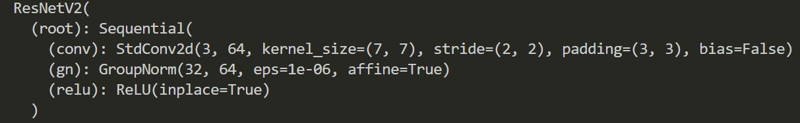
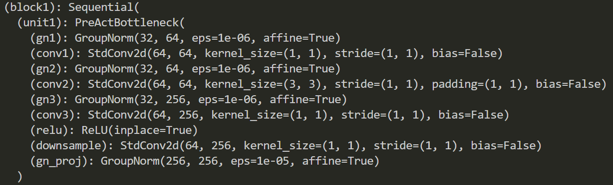
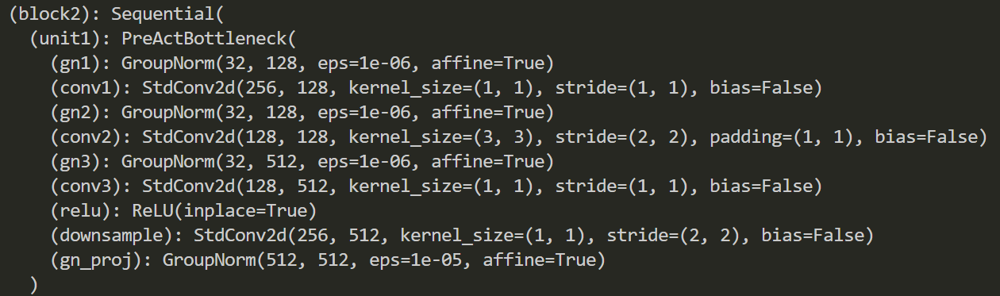
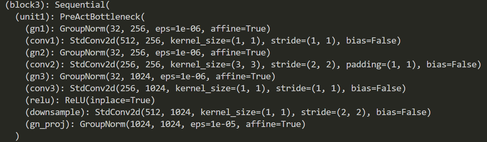
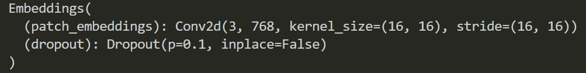
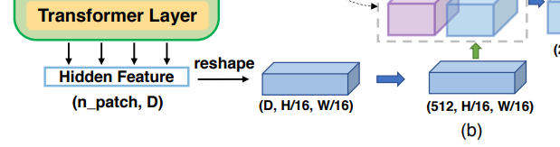

# TransUNet
项目来自：[TransUNet](https://github.com/Beckschen/TransUNet) 
论文：[TransUNet: Transformers Make Strong Encoders for Medical Image Segmentation](https://arxiv.org/pdf/2102.04306.pdf)

## TransUNet结构
结合UNet和Transformer,具体模块包含ViT+ResNet50+skip connection 
在编码器中使用**hybrid CNN-Transformer** 
解码过程使用**Cascaded Upsampler** 
既能提取CNN的局部细节信息，又能提取到Transformer的全局上下文信息。

原始输入维度是H×W×C，期望输出能够划分出每一个像素值的类别，实现分割。在UNet结构上增加了**self-attention**机制，通过在**encoder**中增加**Transformer**来实现。

TransUNet整体网络结构：

## 1、Encoder（hybrid CNN-Transformer）

**1.1 encoder中的CNN  **

ResnetV2网络提取特征，对图片做下采样处理。其中root模块卷积操作的步长为2；

block1堆叠多个bottleneck结构的卷积操作，特征层大小不变；

block2堆叠多个bottleneck结构的卷积操作，步长为2，特征层宽高减半；

block3堆叠多个bottleneck结构的卷积操作，步长为2，特征层宽高减半；

经过CNN下采样之后的特征层经过1×1卷积调整通道数

- 输出的特征层经过embedding 处理
  

**1.2 embedding**

对于输入到Transformer中的序列必须是一维的，需要对输入的图片做变换处理。

- 首先将H×W原始图片划分成P×P大小的patch,patch数量为N。

  $N=\frac{H×W}{p^2}$

- patch embedding:将patch向量映射到D维空间，并增加位置编码

  $Z=[X_p^1E,X_p^2E,...X_p^NE]+E_{pos}$
  
  $E$ 表示将patch映射到D维线性空间的变换矩阵，是可训练的参数， $E_{pos}$ 表示位置编码。
  线性空间变换之后矩阵维度是N×D，与位置编码相加得到向量维度是N×D。

- Transformer结构可以由以下公式表示：
  
  $z'_l=MSA(LN(z_{l-1}))+z_{l-1}$ , 

  $z_l=MLP(LN(z'_l))+z'_l$ , 

  首先经过Layer Normalization，经过Multi-head Self Attention,再加上残差结构。 
  结果再经过Layer Normalization，经过MLP全连接，再加上残差结构 实现Transformer。

- 经过Transformer结构的输出向量维度是N×D，需要经过一步变换，使得上采样过程能够还原到原始的图像分辨率。对应网络结构图的这个位置：

  patch数量 $N$ 是由 $\frac{H×W}{p^2}$ 得到的，将 $N$ 转化为 $\frac{H}{p}×\frac{W}{p}$  
  Trasnformer输出结果（N,D）reshape成（D，H/p，W/p），再经过1×1卷积调整通道数得到（512，H/p，W/p）。

## 2、Decoder（Cascaded Upsampler CUP）

  
